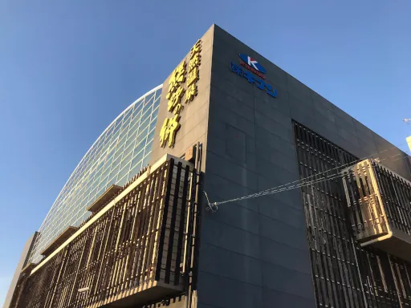
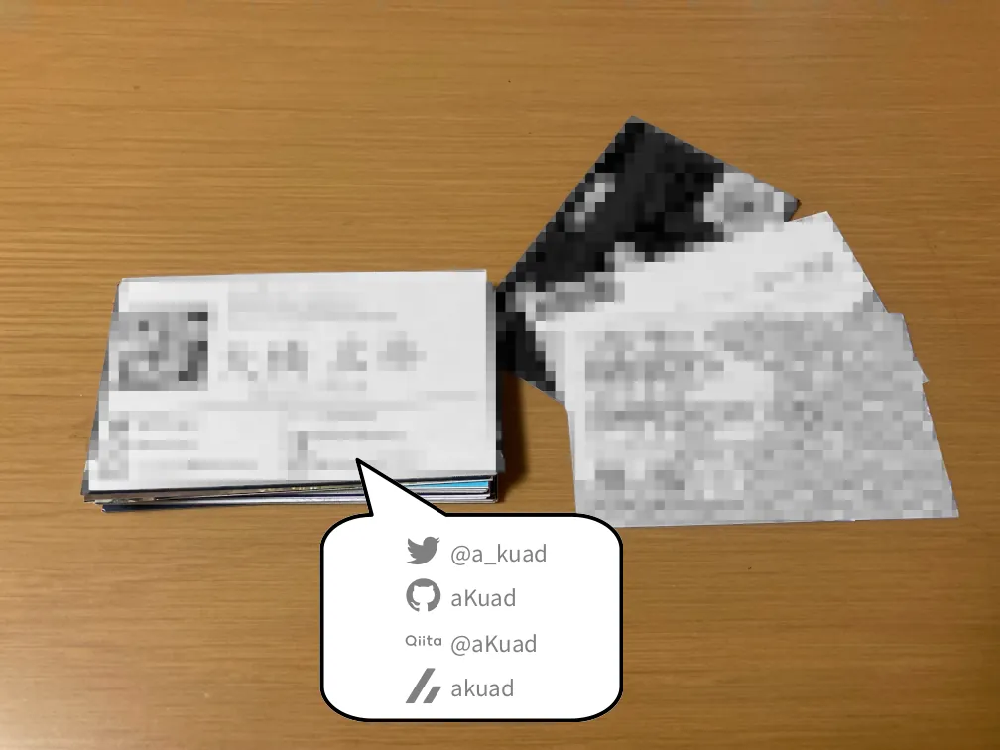

# 終了後編

## 帰路の寄り道

[当日編](./meeting.md)でも少し触れましたが、会場の近くに温浴施設[熊野の郷](https://www.kumano-no-sato.com/naruohama/)があります。

(画像は 第17回 2019年 12月開催時に著者が X へ投稿した画像)

ここで交流会の疲れを癒やすのも良いでしょう。知り合いがいる、または知り合いができたのであれば、誘って交流会の延長戦というのも良いかもしれません。

ただし、あまりゆっくりしすぎて帰りの交通機関の予約に遅れてしまうことのないよう注意しましょう。

!> 著者 aKuad は、新大阪駅で新幹線への乗り換え猶予が 4分とかいうデンジャラス旅をやらかしました。

## SNS のフォロー

交流を通して、他高専の様々な方の名刺を獲得できたことでしょう。もし動向の気になる相手がいれば、名刺の連絡先を確認し、フォローなどをしておきましょう。

## ノウハウ共有

交流で、他高専の方の色々なお話を聞いたり、設計データや資料をもらえたりしたはずです。個人のメモにとどめず、チームメンバーに共有しましょう。

共有の体制がなければ、これを機にオンラインストレージを用意したり、[esa.io](https://esa.io/) などのドキュメント共有サービスを導入したりすると良いでしょう。
