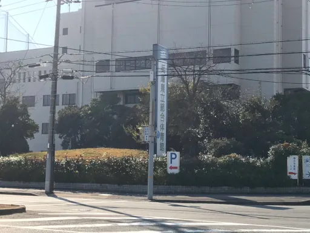
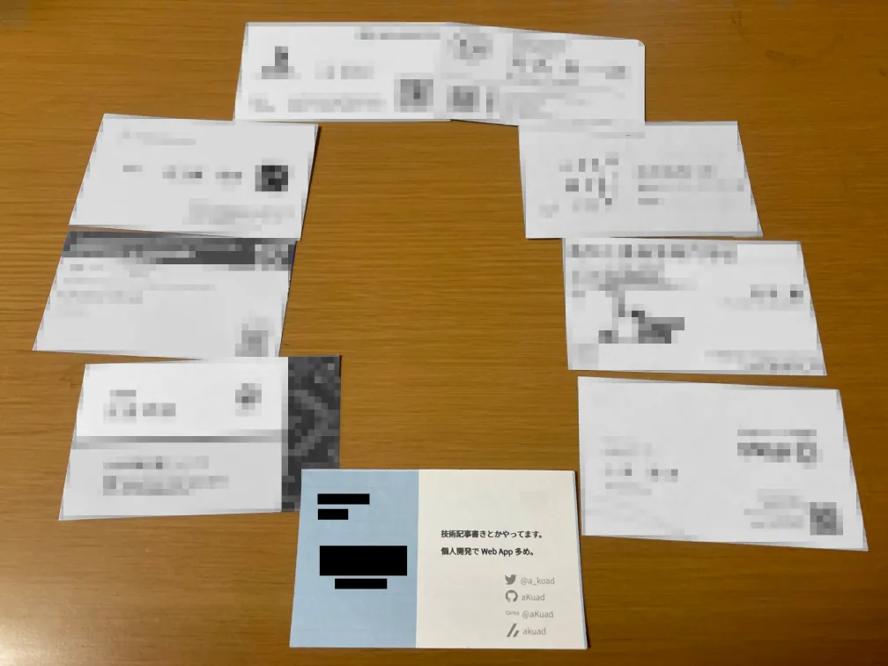

# 当日編

!> この流れは第22回 (2024年 12月) 開催時のスケジュール順です。開催の事情次第では順番が変わるかもしれません。

## 受付

(画像は 第17回 2019年 12月開催時に著者が X へ投稿した画像)

会場に到着したら、まずは受付で参加費を出します (各高専の代表者の方が対応します)。事前に封筒に参加費をまとめておき、幹事団の皆さんのスムーズな受付に協力しましょう。

受付が済んだら、幹事の方の指示に従って荷物の移動をし、開会式まで待ちます。ブース展示をする方は、こちらも幹事の方の指示に従って展示準備を進めます。

全員が全ての荷物を持って展示会場に入るわけにはいきません。貴重品などを除いた荷物は、幹事の方の指示で所定の場所へ置いておきます。

## ブース展示

開会式が終わったらブース展示のスタートです。

会場に机が並べられ、各ブースで機構や回路、デモ動画紹介などがされます。

(X のポストの埋め込みが上手くいかなかったのでリンク貼りで許してください m(\_ \_)m)

[第22回 呉高専さん 独ステの展示](https://x.com/zenrobo_info/status/1867812918903157045)

[第22回 豊田高専さん 学生ロボコン 2024 R1 の展示](https://x.com/zenrobo_info/status/1867812633547874593)

興味のあるブースを見つけたら、ここで準備してきた名刺の出番です。声を掛け、まずは名刺交換をしましょう。

展示されているものについて質問したり、相手の役職から共通の話題を探ったりと、普段話すことのない他高専の方々と技術交流を楽しみましょう。

!> ロボットや回路の写真を撮ることもできますが、必ず「写真撮ってもいいですか？」と確認しましょう。相手の事情によっては、撮ってはいけなかったり、あるいは撮るのはいいが SNS には載せないでほしかったりなど、何らかの制約があるかもしれません。

## 分割会議

設計、加工、回路、プログラムの部門別で、8~9人のグループに分けられて交流をします。(これは宿泊部屋の割り当てでもあります)

会議と言っても、そんな堅苦しいことをするわけではありません。ブース展示と変わらず自由に交流を楽しみます。部門ごとのグループなので、ブース展示などに比べて共通の話題を見つけやすいでしょう。

やはりここでも用意してきた名刺の登場です。分割会議のメンバーが集まったら、まずは名刺交換から始めましょう。

相手の名前や所属高専を把握しながら会話を進めるために、座っている並びにあわせて相手の名刺を手元に置いておくと良いでしょう。

## 宿泊部屋 鍵配布

宿泊部屋グループごとに移動します。同時に荷物も回収します。部屋のリーダーに鍵が渡され、部屋に入ります。

8人 (最大) 1部屋になります。鍵の扱いをどうするかは、部屋に入った段階で相談しておくとよいでしょう。部屋に入れず連絡待ち、というトラブルを避けるためです。(基本は開けっ放しになるかとは思いますが)

また、貴重品の管理には注意しましょう。

!> 過去に窃盗のトラブルがあったという話を著者は聞いていませんが、何かあって厄介にならないよう防衛はすべきです。

## 夕食・風呂

しおりで決められた時間割に沿って夕食と風呂に向かいます。

宿泊施設の風呂のキャパシティは少なく、それに対して数百人という人数が使用するため、(男子風呂は確実で) 非常に混みます。その上、スケジュールの都合でプレゼンと時間がかぶってしまいます。

タイミングが合えば、風呂を済ませた上で、プレゼンも最初から聴講できます。しかし大半の人は、プレゼンを諦めて風呂に並ぶか、その日の風呂を諦めるか、はたまたプレゼン後の滑り込みでの風呂に賭けるか、選択を迫られます。

?> あるいは、会場の近くに温浴施設[熊野の郷](https://www.kumano-no-sato.com/naruohama/)があり、会場からの外出も可能なので、課金して快適な入浴を楽しむのも手です。ただし、会場の門限は 22:00 となっているため、それまでには会場に戻れるよう注意しましょう。

## プレゼン

スケジュールの都合で、複数の登壇が同時並行で進められます。しおりを確認し、興味のあるプレゼンを聴講しましょう。

?> 第22回 (2024年 12月) では、プレゼン・技術講習が YouTube Live で配信・アーカイブされる試みがされました。今後継続されるかは分かりませんが、興味あるプレゼンが並列開催でも、見逃し視聴ができます。

## 秘密の深夜交流

会場の宿泊は 22:30 消灯となっています。が、和室会議室 (例年) で深夜交流が行われます。(一応) オフィシャルなものではないので、日程としては登録されていないイベントです。

睡魔の限界が来るまで、あるいは翌朝の次のイベントまで交流を続けます。朝まで耐えてラジオ体操の時間になったら、ラジオ体操をして睡眠不足をチャラにしましょう (?)。

!> 帰宅のための体力も必要ですので、くれぐれも無理ならさず。徹夜は計画的に。

## 朝食・宿泊部屋 片付け

ここから 2日目です。朝食、寝具など宿泊部屋の片付け (人によっては不要) を済ませ、部屋で待機します。

幹事の方の指示を待って、鍵を返却し、フリー交流会場へ移ります。このときもまた、全員が全ての荷物を持って移動するわけにはいかないので、貴重品などを除いた荷物は指定の場所へ置いておきます。

## フリー交流・技術講習聴講

フリー交流と技術講習が並列で開催されます。技術講習も (テーマ数次第では) 複数のテーマが並列開催されます。

技術講習が終わったらフリー交流に合流し、閉会式まで待ちます。

## 写真撮影

閉会式が終わったら、幹事の方の指示に従い、順番で荷物を回収し、会場を出ます。その後、会場外の広い階段に並び、集合写真を撮影します。

[全国ロボコン交流会 X にて集合写真が上がっています](https://x.com/zenrobo_info/status/1868861196730089547) (リンクは第22回開催時の写真)。

撮影が終わったら、これにてイベント自体は終了です。しかし、家に帰るまでが交流会です。疲れた体にムチを打ち、荷物を持って帰路につきましょう。
