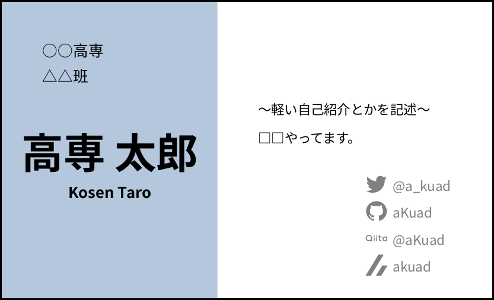
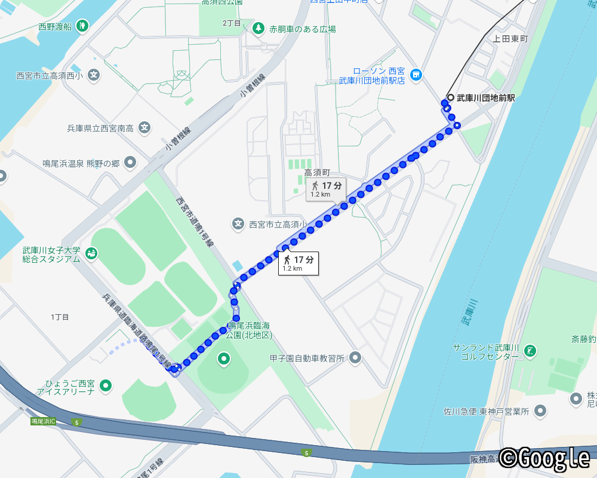

# 準備編

## 参加応募

全ロボは、例年 12月か、年を越した 1月頃に開催されます。開催日の約 1,2ヶ月ほど前に、参加募集のフォームが[全ロボ公式サイト](https://www.zenrobo.jp/)と、[全ロボ X (旧 Twitter)](https://x.com/zenrobo_info) から公開されます。

「そろそろ全ロボのシーズンだな･･･」と感じる 10月下旬頃に入ったら、しっかりサイトや X を確認しましょう。当然ながら、これを忘れてしまうと参加できません。または泣きながら幹事団さんに参加希望の問い合わせをする羽目になります。(著者 2敗)

プレゼン・技術講習会の登壇を希望する方は、登壇募集フォームもお見逃しなく。

## 名刺作成

交流をはじめるきっかけに、名刺はとても有効です。詳しい使い方は当日編で説明します。

X などの連絡先、GitHub などの成果物保存先を記しておくと、交流会終了後もつながりを持つことができます。

?> 名刺に**学年を書かない** (または代わりに入学年を書く) ようにすることで、学年が変わった後も同じ名刺を**使いまわすことができます**。気合を入れて本年限りの名刺を作るこだわりを捨てろ、とは言いませんが、深いこだわりがない方にはオススメです。

なお、名刺は**時間があるときに早めに作成しましょう**。書く内容に迷ったり、印刷にトラブったりして、予想外に時間を食われることがあります。出発前夜、焦りながら PC やプリンタと向き合う夜を過ごしたくはないでしょう。

?> 印刷について、自宅や部活で使えるプリンタ + 100均の名刺台紙が値段的には最も安価ではあります。ですが、印刷サービスを使用するのも手です。トラブルで紙やインクや時間を無駄にする心配がなかったり、ズレなくキレイに印刷してくれたりするため、それらの価値を含めて数百円多く出すのも悪い選択肢ではないでしょう。(なお著者 aKuad はその数百円をケチりました)

## 会場への移動ルート構築

会場となる兵庫県立総合体育館の最寄り駅は武庫川団地前駅で、会場まで徒歩で約17分ほどです (Google Map 計算)。

初めてで道に少し迷ったり、展示のために荷物が多かったり、昼の軽食手配をしたりする場合、もう少し時間がかかると見るべきです。余裕のある移動時間で、事前に電車乗り換えを調べておきましょう。(著者 1敗)

## 持ち物・展示品準備

交流会の数日前に、しおりが配信されます。しおりに持ち物の記載があるので、それを参考に準備を進めましょう。

展示品がある場合は、もちろんそれも準備します。遠方からで長距離移動する場合、運びやすいよう工夫が必要になります。あるいは、輸送業者を利用するのも手です。

なお、シャンプー、ボディーソープは会場の浴室に備え付けであります。(強いこだわりがある方は除いて) 持参する必要はありません。

ちなみに、必須ではありませんが**テーブルタップを持参しておくとヒーローになれます**。

## プレゼン準備

翌日朝早いために早く寝たいのに、寝ずにスライド作りに勤しむのは嫌なはずです。皆が交流を楽しんでいる中、1人焦りながらスライド作りに勤しむのも嫌なはずです。

どんなに遅くても、交流会 2日前にはプレゼンの準備を終えておきましょう。

ところで、相性問題などにより突然他の PC で発表することになった、なんて事態が起きるかもしれません。そんな場合に備えて、スライドデータは USB メモリなどのオフラインストレージに持っておくとより確実です。

!> 会場のネットワークは、お世辞にも速度は期待できないので、オンラインストレージだとダウンロードに非常に時間がかかる恐れがあります。
